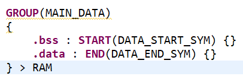

## Simple Checkpoint

This is the code for a simple checkpoint of a device's state, designed for use with the MSP430 (FR2433). Calling the macro `SIMPLE_CHECKPOINT()` saves the registers, the stack, _all_ globals, and a portion of the heap. The macro requires that the user deignate an area on the heap to be checkpointed, by passing a pointer to its start, and its length in bytes as parameters. The checkpointing routine is then able to infer all other properties of the checkpoint through the use of linker variables. Unfortunately, linker variables require some setup.

### Setting Up Linker Variables
There are three linker variables needed for the checkpoint to function properly:
- `SYSMEM_SIZE_SYM`
- `DATA_START_SYM`
- `DATA_END_SYM`

The first modification that must be made to the linker file is to make uninitialized and initialized data contiguous in memory. This can be done by grouping them like this:

The start and end statements seen in the screenshot must also be added. This will define `DATA_START_SYM` and `DATA_END_SYM`.

The final step is to define `SYSMEM_SIZE_SYM` as the size of the sysmem section (heap) like so:

After all the start, end, and size statements are added, and the data sections are grouped, the checkpoint routine is ready! It can be called with `SIMPLE_CHECKPOINT(pointer_to_heap_section_start, heap_section_size)`.

### Drawbacks so far
- First and foremost, there's a bug somewhere in the checkpointing code that only appears when the device is cycled on and off rapidly
- The area on the heap to be checkpointed must be specified
   - this could be automated in the future (?)
- The entire global data section is checkpointed everytime, regardless of what has changed
   - very inefficient

